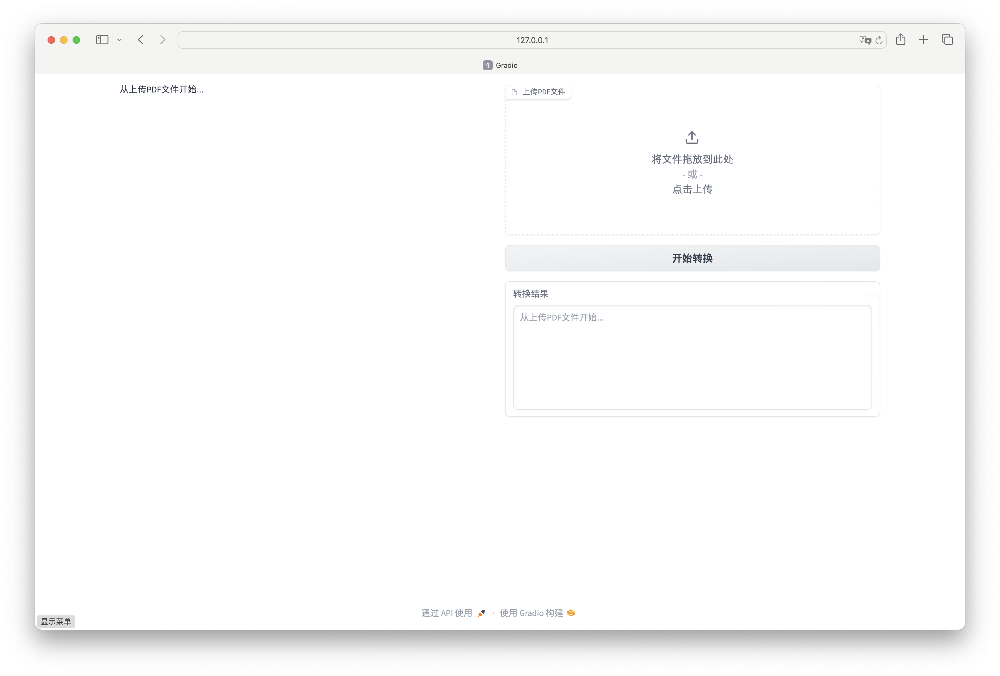
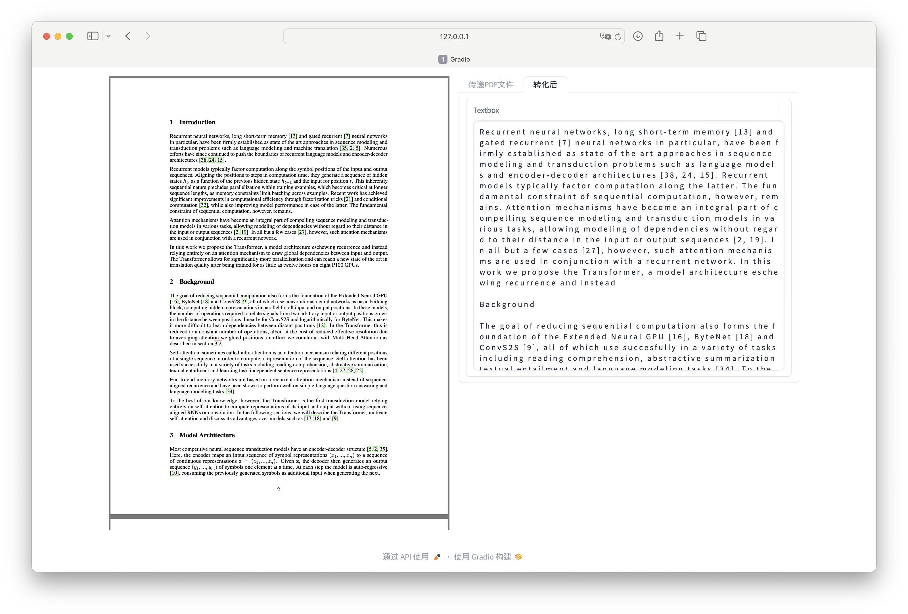

# pdf2md

## 前言

整体框架:

1. 文档版面识别
2. OCR
3. 阅读顺序还原
4. 段落篇章还原(基于llm)
5. 生成markdown

> 目前来看该项目已经有整体框架,但是改进空间巨大,效果有待提升.

## 环境安装

```bash
conda create -n pdf2md python=3.10
conda activate pdf2md
pip install -r requirements.yml
```

## 文件目录

- src: 源码
  - app.py: 基于gradio的网页demo
  - pdf2md.py: pdf与markdown文件转换器
  - hp_pdf2md.py: 该文件夹下代码超参数
  - llm/: 用于格式化ocr后的文本的大模型
    - hp_api.py: 大模型接口配置超参数
    - ollama.py: ollama模型请求接口
    - gemini.py: gemini模型请求接口
  - word2md/: word和markdown转换模块
    - word2md.py: word和markdown双向转换器
  - pdf2md/: pdf与markdown文件转化器源码
    - order/: 阅读顺序还原相关文件
      - hp_order.py: 该文件夹下代码超参数
      - model/: 顺序还原模型文件
      - aux.py: 辅助函数
      - boxes2order.py: 阅读顺序还原模块
    - ocr/: 光学文字识别模块
      - hp_ocr.py: 该文件夹下代码超参数
      - ocr_imgbyimg.py: 光学文字识别模块
    - others/: pdf与png转换器
      - hp_pdf2imgs.py: 该文件夹下代码超参数
      - pdf2imgs.py: pdf与png双向转换器

## 使用方法

### Mac平台

1. `brew install ollama`
2. `ollama pull xxxx`, 在这里使用`ollama pull gemma:7b`
3. `ollama serve`启动服务
4. `cd xxx/src/`
5. `python app.py`





### Win平台

1. `winget install ollama`
2. 其余同上
